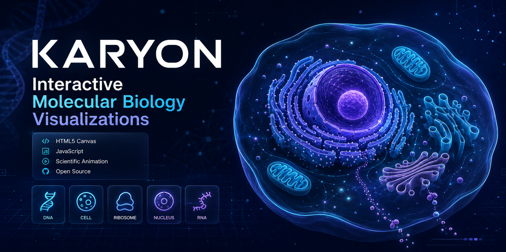

  

# 🧬 Karyon

### Interactive Molecular Biology Visualizations

Scientific visualization library built with HTML5 Canvas for biology education, communication, and interactive learning.

---

## 📖 Overview

**Karyon** is an open-source molecular biology visualization library. Its current module demonstrates **RNA Polymerase I transcription of rDNA in the nucleolus**, from pre-rRNA synthesis to ribosomal subunit assembly and nuclear export.

---

## ✨ Features

- 🧬 Scientifically accurate visualizations
- 🎥 Interactive HTML5 Canvas animations
- ⚡ Smooth transitions and animations
- 🌐 Browser-based with no dependencies
- 📱 Responsive design
- 🎓 Built for education and science communication

---

## 📜 License

GNU General Public License v3.0 (GPL-3.0)

---

## 👨‍🏫 Author

**Draven Ashcroft**

**M.Sc. Agricultural Entomology**  
**ASRB–NET Qualified**  
**DIPS Chain of Institutions, Tanda**

---

## 🙏 Acknowledgements

Developed with assistance from modern AI tools.

Special thanks to:

- **OpenAI (ChatGPT)** — scientific review, debugging, and implementation
- **Anthropic Claude** — implementation assistance and optimization
- **Google Gemini** — concept exploration and refinement
- **Moonshot AI** — debugging and prototype refinement
- **DeepSeek** — early drafts and experimentation

Inspired by **BioRender**, **Nature Reviews Molecular Biology**, and **NCERT Biology**.

---

## 🧬 Karyon

### *Initiating the Code of Life.*

